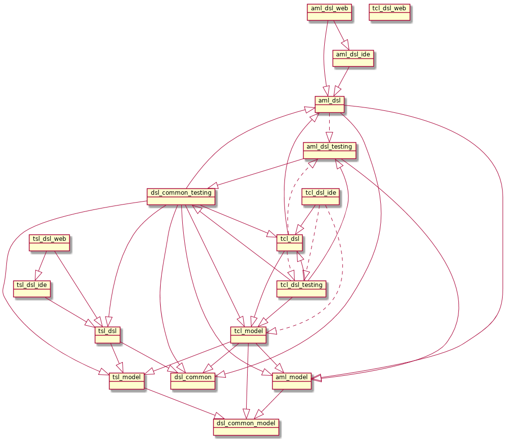

# test-editor-xtext-gradle

[](https://www.eclipse.org/legal/epl-v10.html)
[](https://travis-ci.org/test-editor/test-editor-xtext-gradle)

Gradle based project to build Xtext test-editor languages.

The resulting language jars provide rich editing and test generation facilities. They are wrapped into rest services served by [test-editor-backend](https://github.com/test-editor/test-editor-backend).

## Development

### Setup

``` shell
git clone https://github.com/test-editor/test-editor-xtext-gradle.git  # clone the sources
curl https://nixos.org/nix/install | sh                                # get nix package manager (if you happen to not have it installed)
cd test-editor-xtext-gradle                                            # switch into cloned repo
nix-shell                                                              # setup build environment (takes a bit on first invocation)
```

### Eclipse based development

- Make sure to have `Xtext SDK 2.15`, `Buildship 2.2.1` installed (e.g. use Eclipse DSL Edition 4.9.0)
- Generate eclipse project meta data:

```shell
./gradlew eclipse
```

- Import this project as gradle project.
- Make sure to disable errors on dependency cycles (which eclipse runs in because of limited dependency resolution capabilities).
  Preferences -> Java -> Compiler -> Building -> Build Path Problems -> Circular dependencies
  
### Build

    ./gradlew build
    
If the build process stops with failures generating the Xtext languages, it usually helps to rerun all gradle tasks.
 
    ./gradlew build --rerun-tasks
 
### Release process

In order to create a release switch to the `master` branch and execute

    ./gradlew release

and enter the new version. After the commit and tag is pushed Travis will automatically build and deploy the tagged version to Bintray.

### Project overview

You may notice a certain symmetry of the xtext language projects tsl, tcl and aml. To get a more detailed description of the subprojects, please look at their respective README.md.

- [aml.dsl](org.testeditor.aml.dsl/README.md)
  Xtext language definition for the application mapping language (aml)
- aml.dsl.ide
  Additional functionality for editors for the aml
- aml.dsl.testing
  Testing code that can be reused by other projects
- aml.dsl.web
  Project for web-editor specific code (purely generated from aml.dsl)
- aml.model
  Xcore model for the AST of parsed aml artifacts
  
- dsl.common
  Reusable functionality for all test-editor languages (tsl, tcl, aml)
- dsl.common.model
  Reusable functionality for all test-editor language AST models
- dsl.common.testing
  Reusable functionality for testing all test-editor languages
  
- tcl.dsl
  Xtext language definition for the test case language (tcl)
- tcl.dsl.ide
  Additional functionality for editors for the tcl
- tcl.dsl.testing
  Testing code that can be reused
- tcl.dsl.web
  Project for web-editor specific code (purely generated from tcl.dsl)
- tcl.model
  Xcore model for the AST of parsed tcl artifacts
  
- tsl.dsl
  Xtext language definition for the test specification language (tsl)
- tsl.dsl.ide
  Additional functionality for editors for the tsl
- tsl.dsl.web
  Project for web-editor specific code (mostly generated from tsl.dsl)
- tsl.model
  Xcore model for the AST of parsed tsl artifacts

### Project dependencies

Given the number of subprojects within this project, the following graphics may shed some light into what dependencies currently exist.

`Compile` dependencies are regular arrows, `testCompile` dependencies are dashed arrows

